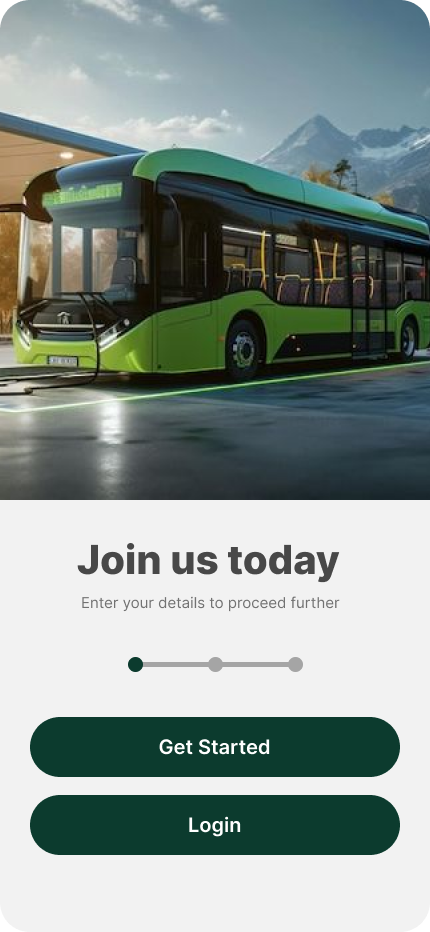
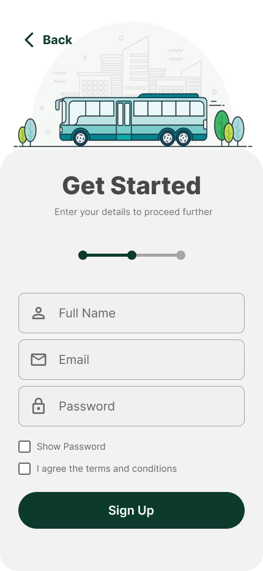
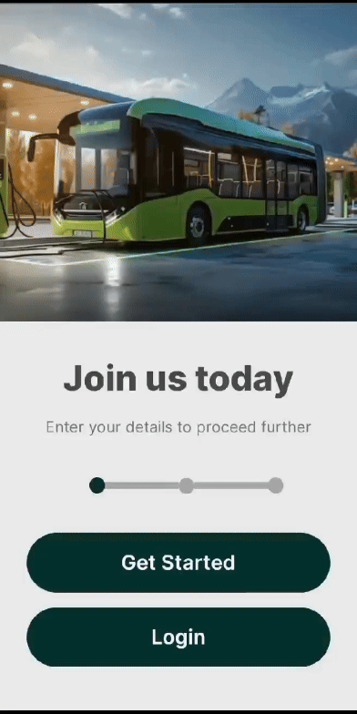
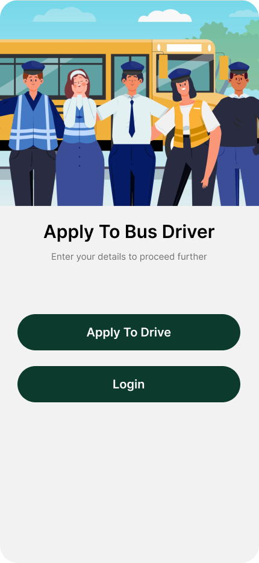
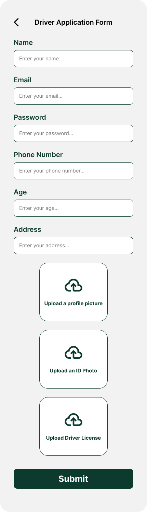
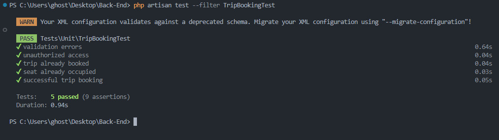

<br><br>

<!-- project philosophy -->


> A smart transportation system designed to optimize bus transportation by providing real-time tracking, route optimization, and passenger management. This platform offers an enhanced commuting experience by ensuring efficiency and convenience for both passengers and bus operators.
>
> The IoT-Based Smart Bus Transportation System aims to transform public transportation by integrating IoT devices and smart technology. Users can track buses in real time, get optimized routes, and manage passenger loads. This project focuses on improving operational efficiency and passenger experience through automation and real-time data.

### User Stories

#### Customer
- As a customer, I want to view the real-time location of the bus, so I can know where I am exactly.
- As a customer, I want to know the estimated arrival time of the buses, so I can know when I'm possibly arriving.
- As a customer, I want to purchase digital tickets, so I can board the bus without needing cash or a physical ticket.

#### Driver
- As a driver, I want to update real-time location, so customers can see where they are.
- As a driver, I want to log my working hours, so I can keep track of my shifts.
- As a driver, I want to scan customers QR code, so I check if the customer is in the right trip.

#### Admin
- As an admin, I want to make trips and organize the buses schedules, so I can ensure timely service.
- As an admin, I want to check drivers applications, and choose whether to approve or reject the driver.
- As an admin, I want to manage user accounts, so I can keep track of active customers.

<br><br>
<!-- Tech stack -->


###  iBus is built using the following technologies:

- Frontend: The mobile app uses React Native to provide a cross-platform experience on both iOS and Android devices. React Native allows us to create a highly interactive and user-friendly interface with a single codebase.

- Backend: The backend API is developed using Laravel, a robust PHP framework that provides RESTful API endpoints for managing data and handling requests efficiently.

- Database: For persistent storage and efficient data management, the project utilizes MySQL. MySQL handles all backend data operations, including user data, bus schedules, and real-time tracking information.

- Real-time Communication: The application uses Socket.io to provide real-time updates for bus locations, route changes, and passenger notifications, ensuring users receive up-to-date information instantly.

- Firebase: Used firebase storage for Storing the users image and picture and helping for the drivers applications to be done

- IoT Integration:

    - Seat Detection System: The system includes an Arduino kit using the ESP8266 WiFi module, ultrasonic sensor, and UNO board for real-time detection of someone sitting on the bus seat. This data is sent to the backend, ensuring real-time updates on seat availability.
    - Bus Tracking: The system integrates GPS modules for real-time location tracking, as well as passenger load sensors for monitoring bus capacity.

- FastAPI: FastAPI is used to implement a machine learning model for predicting bus arrival times. The model analyzes historical trip data and provides accurate arrival time predictions based on current conditions.

- For Admin Panel: The admin panel is developed using React.js, specifically designed to offer a seamless experience for administrators managing schedules, buses, and routes.

<br><br>
<!-- UI UX -->


> We designed iBus using wireframes and mockups, iterating on the design until we reached the ideal layout for easy navigation and a seamless user experience.

- Project Figma design [figma](https://www.figma.com/design/ipjDqjMgkYGaluOob6EjFh/iBus?node-id=0-1&t=0MmCr4qldXY9ofRe-1)


### Mockups
| Home screen  | Search Screen |
| ---| ---|
|  |  |

<br><br>

<!-- Database Design -->


###  Architecting Data Excellence: Innovative Database Design Strategies:

- 


<br><br>


<!-- Implementation -->


### User Screens (Mobile)
| Landing screen | Register screen | Login screen |
| ---| ---| ---|
|  |  |  |

| Trips screen | Home screen | Search Screen |
| ---| ---| ---|
|  |  |  |


| Landing Page / Login / Register                              | Booking a Trip                         |
| ----------------------------------------- | --------------------------------------- |
|  |  |


| Bus Screen | Booking Screen | Profile Screen |
| ---| ---| ---|
|  |  |  |

### Driver Screens (Mobile)
| Landing screen  | Login screen | Application screen |
| ---| ---| ---|
|  |  |  |

| Trips screen | Trip Info screen |
| ---| ---|
|  |  |


### Admin Screens (Web)
| Login screen  | Dashboard screen |
| ---| ---|
|  |  |
| Trip Making screen  |  Users screen |
|  |  |

<br><br>


<!-- Prompt Engineering -->


###  Intelligent Transportation Assistant: Enhancing the User experience of Public Tranporation:

- This project leverages cutting-edge IoT integration and data management techniques to enhance the experience of public bus transportation users.

###  Smart Assistant with OpenAI Propmt:

- 


<br><br>

<!-- AWS Deployment -->


###  Efficient Deployment: Unleashing the Potential with AWS Integration:

- This project leverages deployment strategies to seamlessly integrate AWS EC2 instance to host Laravel Based web application with SQL database  and deploy natural language processing models. With a focus on scalability, reliability, and performance.

- 

<br><br>

<!-- Unit Testing -->


###  Ensuring Backend Integrity: The Role of Unit Testing

- Backend Testing:

- This project integrates comprehensive unit testing protocols to validate the functionality of backend components. By isolating and testing each unit, we mitigate risks, enhance code reliability, and ensure the backend operates seamlessly under various conditions. This approach allows for early detection and resolution of issues, reinforcing the system's stability.

###  Test Samples




<br><br>


<!-- How to run -->


> To set up iBus locally, follow these steps:

### Prerequisites

Ensure you have the following hardware and software:

- **Arduino UNO board**
- **ESP8266 Wi-Fi module**
- **Ultrasonic sensor**
- **npm** (Node Package Manager)
- **Composer** (for PHP dependencies)


* npm
  ```sh
  npm install npm@latest -g
  ```

### Installation

Follow the steps below to install and set up iBus:


1. Clone the repo
   git clone [github](https://github.com/SamirJabre/Smart-Bus-System.git)
   ```sh
   git clone --recurse-submodules https://github.com/SamirJabre/Smart-Bus-System.git
   ```
2. For Laravel

   ```sh
   composer install
   ```
   ```sh
   npm install
   ```
3. For the React Native
   ```sh
   npm install
   ```
   ```sh
   npx expo install
   ```
4. For the Admin Panel(React js)
   ```sh
   npm install
   ```
4. To run the app
   ```sh
   npx expo start
   ```
   ```sh
   php artisan serve --host:your_ip_address
   ```
   ```sh
   node server.js
   ```
   ```sh
   python -m uvicorn app:app --reload
   ```

Now, you should be able to run iBus locally and explore its features.