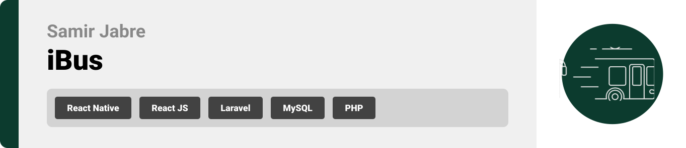
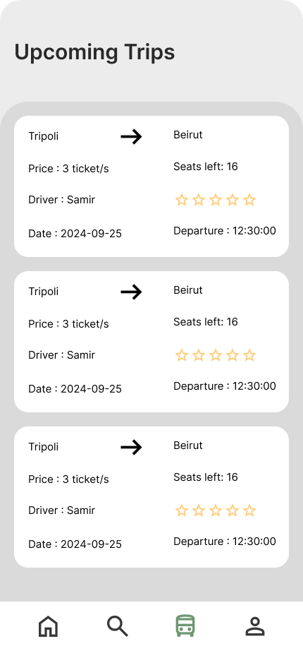
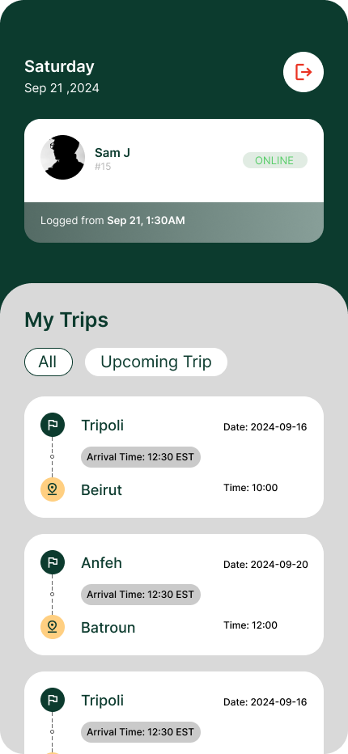
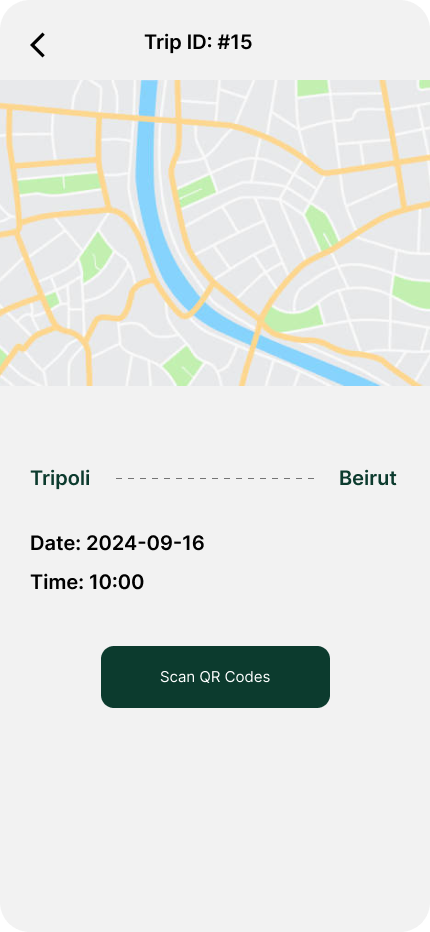

<br><br>

<!-- project philosophy -->


> A smart transportation system designed to optimize bus transportation by providing real-time tracking, route optimization, and passenger management. This platform offers an enhanced commuting experience by ensuring efficiency and convenience for both passengers and bus operators.
>
> The IoT-Based Smart Bus Transportation System aims to transform public transportation by integrating IoT devices and smart technology. Users can track buses in real time, get optimized routes, and manage passenger loads. This project focuses on improving operational efficiency and passenger experience through automation and real-time data.

### User Stories

#### Customer
- As a customer, I want to view the real-time location of the bus, so I can know where I am exactly.
- As a customer, I want to know the estimated arrival time of the buses, so I can know when I'm possibly arriving.
- As a customer, I want to purchase digital tickets, so I can board the bus without needing cash or a physical ticket.

#### Driver
- As a driver, I want to update real-time location, so customers can see where they are.
- As a driver, I want to log my working hours, so I can keep track of my shifts.
- As a driver, I want to scan customers QR code, so I check if the customer is in the right trip.

#### Admin
- As an admin, I want to make trips and organize the buses schedules, so I can ensure timely service.
- As an admin, I want to check drivers applications, and choose whether to approve or reject the driver.
- As an admin, I want to manage user accounts, so I can keep track of active customers.

<br><br>
<!-- Tech stack -->


###  iBus is built using the following technologies:

- Frontend: The mobile app uses React Native to provide a cross-platform experience on both iOS and Android devices. React Native allows us to create a highly interactive and user-friendly interface with a single codebase
- Backend: The backend API is developed using Laravel, a robust PHP framework that provides RESTful API endpoints for managing data and handling requests efficiently.
- Database: For persistent storage and efficient data management, the project utilizes MySQL. MySQL handles all the backend data operations, including user data, bus schedules, and real-time tracking information.
- Real-time Communication: The application uses Socket.io to provide real-time updates for bus locations, route changes, and passenger notifications, ensuring users receive up-to-date information instantly.
- IoT Integration: The system integrates with various IoT devices such as GPS modules for real-time location tracking, passenger load sensors for monitoring bus capacity.
- For Admin Panel: The admin panel is made with React js specifically for admins.

<br><br>
<!-- UI UX -->


> We designed iBus using wireframes and mockups, iterating on the design until we reached the ideal layout for easy navigation and a seamless user experience.

- Project Figma design [figma](https://www.figma.com/design/ipjDqjMgkYGaluOob6EjFh/iBus?node-id=0-1&t=0MmCr4qldXY9ofRe-1)


### Mockups
| Home screen  | Search Screen |
| ---| ---| ---|
|  |  |

<br><br>

<!-- Database Design -->


###  Architecting Data Excellence: Innovative Database Design Strategies:

- 


<br><br>


<!-- Implementation -->


### User Screens (Mobile)
| Landing screen | Register screen | Login screen |
| ---| ---| ---|
|  |  |  |

| Trips screen | Home screen | Search Screen |
| ---| ---| ---|
|  |  |  |

| Bus Screen | Booking Screen | Profile Screen |
| ---| ---|
|  |  |  |

### Driver Screens (Mobile)
| Landing screen  | Login screen | Application screen |
| ---| ---| ---|
|  |  |  |

| Trips screen | Trip Info screen |
| ---| ---|
|  |  |


### Admin Screens (Web)
| Login screen  | Dashboard screen |  Users screen |
| ---| ---| ---|
|  |  |  |
| Trip Making screen  |
|  |

<br><br>


<!-- Prompt Engineering -->


###  Intelligent Transportation Management: Enhancing the Efficiency of Public Transit:

- This project leverages cutting-edge IoT integration and data management techniques to optimize the efficiency of public bus transportation systems.

<br><br>

<!-- AWS Deployment -->


###  Efficient AI Deployment: Unleashing the Potential with AWS Integration:

- This project leverages AWS deployment strategies to seamlessly integrate and deploy natural language processing models. With a focus on scalability, reliability, and performance, we ensure that AI applications powered by these models deliver robust and responsive solutions for diverse use cases.

<br><br>

<!-- Unit Testing -->


###  To ensure the reliability and correctness of the Smart Bus Transportation System, we have implemented a comprehensive suite of unit tests:

- Backend Testing:

    API Endpoints: Each API endpoint in the Laravel backend is tested to ensure correct responses, including success and error cases.
    Data Validation: Tests are implemented to validate input data for all API routes, ensuring that invalid data is handled gracefully and appropriate error messages are returned.
    Database Operations: All database interactions, such as CRUD operations for bus schedules, passenger data, and ticket management, are tested to ensure data integrity.
- Frontend Testing:

    Component Testing: Each React Native component is tested for rendering, functionality, and proper handling of props and states.
    Integration Tests: We test the integration between components, including user flows like real-time bus tracking, ticket purchase, and notification handling.

<br><br>


<!-- How to run -->


> To set up iBus locally, follow these steps:

### Prerequisites

This is an example of how to list things you need to use the software and how to install them.
* npm
  ```sh
  npm install npm@latest -g
  ```

### Installation

_Below is an example of how you can instruct your audience on installing and setting up your app. This template doesn't rely on any external dependencies or services._

1. Get a free API Key at [example](https://example.com)
2. Clone the repo
   git clone [github](https://github.com/your_username_/Project-Name.git)
3. Install NPM packages
   ```sh
   npm install
   ```
4. Install Expo packages
   ```sh
   npx expo install
   ```
5. To run the app
   ```sh
   npx expo start
   ```

Now, you should be able to run iBus locally and explore its features.